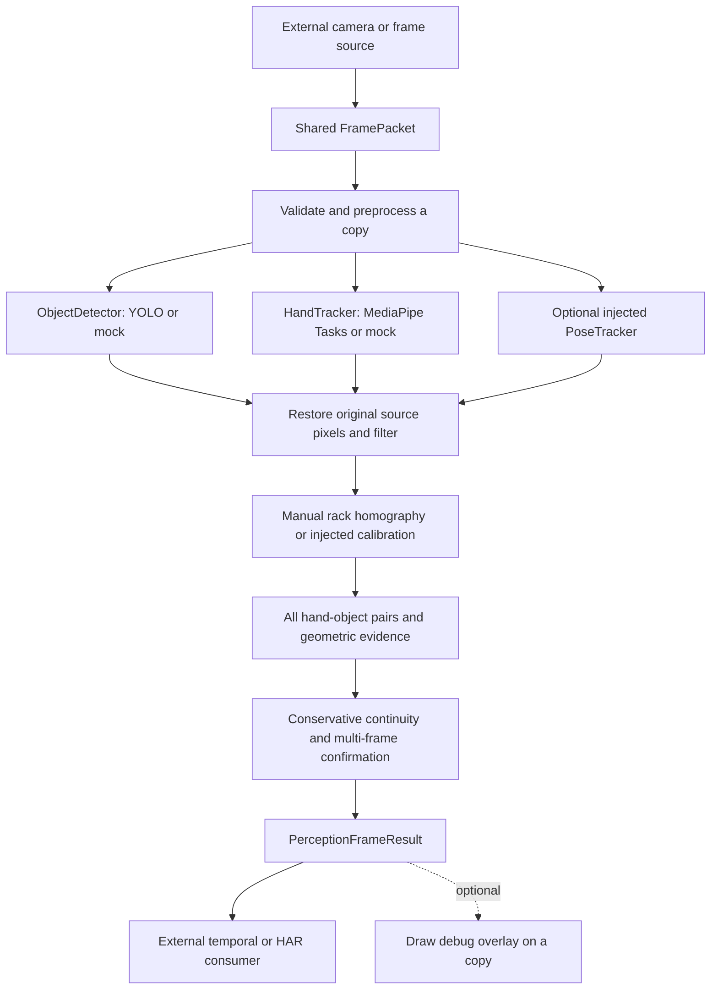

# ORBITA Module 01: Perception Core

An offline frame-to-observation module for SIH26174. It reports object/hand
geometry and confirmed generic interaction **candidates**, not experiment steps
or semantic actions. The caller owns capture, logging, HAR, procedures and UI.

## Repository assessment and scope

The original repository defines a five-module architecture: Module 01 captures
and orchestrates frames; Module 02 owns YOLO; Module 03 owns hands/spatial features.
Those implementations are placeholders. The requested scope instead puts the
complete perception layer in Module 01 and excludes camera ownership/orchestration.
This implementation lives in the import-safe `perception/` package. Numbered
directories, existing packet definitions, main program and other modules are
preserved. No second camera implementation or shared `FramePacket` is introduced.
See [INTEGRATION.md](INTEGRATION.md) for this architectural conflict and the
explicit bridge to existing Module 02 consumers.

## Architecture and data flow



The stabilizer uses recent object/hand continuity before associations to expose
motion; interaction confirmation follows candidate generation. Backend objects
never enter public contracts. Inference dependencies are imported only when real
backends initialize. No cloud API, model download, GUI toolkit, capture loop or
application logging database exists in the core.

## Folder structure

```text
perception/
  __init__.py              public pipeline and config exports
  contracts.py             facade for authoritative shared schemas
  config.py                strict YAML loading and validation
  preprocessing.py         copy, BGR conversion, resize, optional CLAHE, restoration
  detector.py              detector protocol, YOLO adapter, filtering
  hand_tracker.py          hand protocol, Tasks adapter, validation
  pose_tracker.py          optional pose protocol, disabled default
  coordinate_frame.py      reference protocol and manual projective calibration
  associations.py          distances, containment, IoU, ambiguous pairs
  interaction.py           generic candidates only
  stabilizer.py            bounded continuity, confirmation, trends, motion
  pipeline.py              lifecycle, errors, timing and frame-to-result API
  mocks.py                 scripted backends and explicit synthetic demo
  visualization.py         optional copy-only overlay
  integration.py           existing ObjectFrame bridge
  utils.py                 confidence and validation helpers
  README.md, INTEGRATION.md, VERIFICATION.md
shared/schemas/perception_frame_result.py   typed observation contracts
configs/perception.yaml                    real inference configuration
configs/perception_mock.yaml               model-free configuration
configs/perception_tracker.yaml            local ByteTrack configuration
examples/perception_demo.py                model-free integration simulation
examples/perception_camera.py              external capture example
tests/perception/                          camera/model-free unit/integration tests
requirements-perception*.txt               standalone/optional dependencies
models/README.md                           local hand model placement
```

## Installation

The core supports Python 3.11+. Prefer an isolated Python 3.11 environment for
real MediaPipe inference; supported wheel/Python combinations can differ by release.
The [official MediaPipe Python setup guide](https://developers.google.com/edge/mediapipe/solutions/setup_python)
describes platform support. Network access is needed only while installing
dependencies and acquiring models, before offline deployment.

```powershell
py -3.11 -m venv .venv
.venv/Scripts/python.exe -m pip install -r requirements-perception.txt
.venv/Scripts/python.exe -m examples.perception_demo
.venv/Scripts/python.exe -m pytest tests/perception -q
```

For real inference:

```powershell
.venv/Scripts/python.exe -m pip install -r requirements-perception-inference.txt
$env:YOLO_AUTOINSTALL = "false"
$env:YOLO_OFFLINE = "true"
.venv/Scripts/python.exe -m examples.perception_camera --source 0
```

Select the matching PyTorch CPU/CUDA build during installation. ONNX requires
an explicitly installed `onnxruntime` (or its supported GPU distribution);
the adapter will not install it. Future OpenVINO/TensorRT support belongs in
separate `ObjectDetector` implementations, with the same pixel output contract.

MediaPipe and Ultralytics can bring different OpenCV wheel distributions into
one environment. All write the same `cv2` namespace; keep only one distribution.
If both were installed, remove both and reinstall `opencv-contrib-python`:

```powershell
.venv/Scripts/python.exe -m pip uninstall -y opencv-python opencv-contrib-python
.venv/Scripts/python.exe -m pip install opencv-contrib-python
```

Some dependency metadata may still require `opencv-python`; this repair avoids
overlapping `cv2` files. Recheck it after dependency upgrades. The mock suite
requires no PyTorch, Ultralytics or MediaPipe. Existing root `requirements.txt`
remains the whole-team dependency list; standalone files avoid forcing all
inference libraries onto module-only users. Versions are intentionally unpinned;
record the tested environment on target hardware before freezing deployment.

## Configuration and model placement

`PerceptionPipeline.from_yaml("configs/perception.yaml")` validates the settings.
Unknown keys, invalid ranges, nonboolean switches, invalid calibration and
unsupported backends fail clearly. Model/tracker paths resolve relative to the
YAML file, regardless of current working directory. File existence is checked
at backend initialization so injected mocks never need model files.

Real configuration requires these local assets:

* `02_yolo/models/experiment_objects.pt`: **team-trained weights still required**.
  The detector's class names come from those weights; a whitelist uses class IDs.
* `models/hand_landmarker.task`: obtain the compatible bundle from the
  [official Hand Landmarker model page](https://developers.google.com/edge/mediapipe/solutions/vision/hand_landmarker#models).
  A downloaded, git-ignored copy was used for local API smoke verification.
* Measured rack corner coordinates: enable `reference_frame` only after calibration.
  The default real configuration deliberately leaves it disabled and reports
  `reference_frame_unavailable`. Full-image rack corners in the mock YAML are
  synthetic fixture coordinates, not a real calibration.

`detector.tracking: true` enables `model.track(..., persist=True)`, preserving
only IDs supplied by the backend. A local tracker YAML is required. The included
ByteTrack configuration uses no appearance/ReID model. Other supported local
tracker configurations must have `with_reid: false`. Missing dependencies fail
clearly rather than triggering a package download. These predict/track APIs
follow the [Ultralytics prediction](https://docs.ultralytics.com/modes/predict)
and [tracking](https://docs.ultralytics.com/modes/track) documentation.

The adapter sets offline environment defaults **before its first Ultralytics
import**. If another component already imported Ultralytics with auto-install
enabled, initialization fails with instructions to set the above flags before
launching. It does not monkey-patch the other component's library globals.
CPU fallback reports `detector_cpu_fallback`; it retries accelerator failures
only, not malformed inputs/model errors. Missing/corrupt weights fail startup.

## Public API and input contract

```python
import time
import numpy as np
from perception import FramePacket, PerceptionPipeline
from perception.mocks import demo_backends

detector, hands = demo_backends()
with PerceptionPipeline.from_yaml(
    "configs/perception_mock.yaml", detector=detector, hand_tracker=hands
) as perception:
    frame = np.zeros((240, 320, 3), dtype=np.uint8)
    packet = FramePacket(
        frame_id=0,
        timestamp_s=time.monotonic(),
        image=frame,
        width=320,
        height=240,
        source_id="camera_0",
        color_format="BGR",
    )
    result = perception.process(packet)
    print(result.detections, result.interactions, result.warnings)
```

Input is the existing `shared.schemas.FramePacket`. `timestamp_s` is monotonic
seconds, **not wall-clock time**. Width/height must match a nonempty uint8 HxWx3
image. BGR and RGB are accepted; backend images are BGR. Frame IDs and timestamps
must strictly increase for one source per session. Source changes and out-of-order
packets return `INVALID_INPUT` without advancing the active source history.
`reset()` releases model/tracker state before a new source or session.

`initialize()` is optional because the first valid `process()` initializes
lazily. Critical dependency/model initialization failures raise
`InitializationError` and release acquired resources. `close()` is idempotent;
use a context manager for cleanup. Closed pipelines need `reset()` before reuse.
Calls are serialized with a lock; no module-created processing thread exists.
The application should use one dedicated worker per ordered stream.

Backends implement `initialize`, `detect`/`track`, and `close`. Optional pose
tracking is a typed `PoseTracker` interface: inject a backend returning pixel
`PoseObservation`s. No body pose model is bundled/loaded by default.

## Output contracts

All observation schemas are dataclasses/enums defined in
`shared/schemas/perception_frame_result.py`, re-exported by `perception.contracts`.

| Field | Meaning |
|---|---|
| `frame_id`, `timestamp_s`, `source_id` | Preserved caller identity; `timestamp` is a read-only seconds alias |
| `image_width`, `image_height` | Original source dimensions |
| `detections` | Current clipped source-pixel boxes, class/model confidence, optional real track ID, stable flag, duration, optional rack polygon/motion |
| `hands` | Current source-pixel landmarks/palm, optional confidence, handedness metadata and explicit identity persistence |
| `poses` | Optional injected pose observations |
| `associations` | Every hand/object pair including far and ambiguous pairs; distances, overlap, containment, trend, confidence components |
| `interactions` | Current confirmed generic candidates; per-frame indices resolve observations, `object_id=None` without backend tracking |
| `coordinate_frame_valid` | True only if this frame's supplied calibration and transforms succeeded |
| `reference_frame` | Reference ID, transform matrix and source-pixel debug axes when available |
| `association_coordinate_frame` | Explicit `RACK_RELATIVE` or `NORMALIZED_IMAGE`; never silently labels fallback as rack coordinates |
| `status`, `warnings` | Runtime uncertainty/failures; normal empty results can be `NO_DETECTION` |
| `stage_timings_ms`, `processing_time_ms` | Measured stages and total, including lazy initialization on first valid frame |

`reliable_for_temporal_reasoning` is a conservative gate requiring `OK`, valid
rack calibration and at least one stable detection. Consumers must also examine
identity, ambiguity and confidence. `DEGRADED` can still contain useful observations.

## Coordinate systems and rotation

`IMAGE_PIXELS` uses original source image coordinates. Preprocessing uses a copy;
resize scales are restored independently in x and y, including rounded heights.
Ultralytics handles its internal letterboxing and returns boxes in its input
image pixels; the adapter does not double-normalize them.

`NORMALIZED_IMAGE` uses `(x/width, y/height)` and labels fallback distances clearly.
These units are image fractions, not metres and not rotation invariant for
non-square images. `hand_box_iou` is always source-image hand-landmark AABB IoU.

`RACK_RELATIVE` uses a projective homography from four measured rack corners to
`(0,0),(1,0),(1,1),(0,1)`. Supply corners in **physical rack order**:
origin, +x corner, +x/+y corner, +y corner. Do not sort by image up/down.
Calibration can represent 90°, 180° or arbitrary camera-plane rotation and
planar perspective. Each rack axis is normalized independently, so distances
are rack-unit heuristics, not physical metric distances. Transformed object
corners form a polygon used for landmark distance/containment, not its AABB.

The manual calibration assumes a fixed camera and planar stationary rack. It
cannot detect camera/rack movement or marker loss itself: set its `valid=False`
or inject a marker-based `CoordinateTransformer` that updates/invalidates every
frame. The reference ID must change when axes/origin are recalibrated, but may
stay constant for live transforms of the same physical rack. Calibration loss,
recovery or reference ID changes clear interaction/motion geometry history.
If any transform fails, all reference coordinates from that frame are cleared;
normalized-image associations remain available with warnings.

## Geometry, confidence and stabilization

Primitives include point-in-box, distance-to-box/polygon, box IoU and containment,
palm/minimum landmark distances, near/contact thresholds and ambiguous object
associations. Contact and overlap are **2D candidates**: monocular imagery cannot
verify touch, grasping or manipulation. Several similarly close objects are
marked ambiguous; candidates for those ambiguous pairs are suppressed.

Confidence is `ObservationConfidence(detector, tracker, geometry, final)`.
The raw model scores remain available. Geometry is the documented heuristic
`max(0, 1 - minimum_distance / proximity_threshold)`; final initially equals the
minimum known components, never their product. Confirmed interaction confidence
uses an EMA capped by current evidence: `min(current_minimum, EMA)`. This limits
noise without overriding a current low score. Scores are not calibrated contact
probabilities. No known components produces zero, and missing scores stay `None`.

The MediaPipe Tasks result exposes handedness classification scores, not a
per-hand presence confidence. The adapter therefore leaves hand confidence
`None` and exposes handedness confidence separately. It uses the current
[Tasks Hand Landmarker API](https://developers.google.com/edge/mediapipe/solutions/vision/hand_landmarker/python)
in synchronous IMAGE mode. `hand_0`/`hand_1` are per-frame labels with
`identity_persistent=False`; handedness is never used as a persistent identity.

Default confirmation needs 3 consecutive object observations and 4 consecutive
interaction candidates. Tentative histories restart on a missing frame.
Confirmed histories tolerate 2 missing frames; they expire on the third.
Only **current** observations are emitted, never stale boxes/interactions.
Duration counts observed frames, excluding tolerated misses. Backend IDs are
preserved. For untracked objects/ephemeral hands, unique bidirectional class+IoU
or palm-distance matching supplies internal short-term continuity; those keys
are never exposed as persistent IDs. Ambiguous continuity starts new histories.

Frame ID gaps age histories. Large time gaps, resolution changes and invalid
frames reset confirmation. Trend estimates need three consecutive distance
samples; leaving requires prior proximity plus retreat. Motion requires a real
object track, stable detection, consecutive timestamps and valid unchanged rack
identity. Velocity is rack units/second; otherwise motion is `UNKNOWN`.

## Runtime failures and instrumentation

Invalid images/metadata return `INVALID_INPUT`. Detector, hand/pose tracker or
reference errors return surviving observations plus structured warning strings.
Empty detections/hands are ordinary results; no global model instance is used.
Application persistence stays external. Python logging records initialization
and failures only. No log handler/file/database is installed by this module.

Stage timings cover preprocessing, object detection/filter/restoration, hands,
optional poses, coordinates, association, stabilization and total. They are
per-frame measurements, not an FPS benchmark. The overlay helper
`draw_perception_overlay(frame, result, options)` draws boxes, IDs, landmarks,
axes, association lines and warnings on a copy; it opens no windows.

## Running and testing

```powershell
python -m examples.perception_demo --frames 8
python -m pytest tests/perception -q
python -m pytest -q
# After local weights and measured calibration are configured:
python -m examples.perception_camera --source 0
python -m examples.perception_camera --source data/videos/demo.mp4
```

The demo prints structured JSON suitable for a consumer. Synthetic mock scores
and IDs are explicit test fixtures. The real capture example owns/release its
OpenCV capture externally and prints results; it does not implement application
orchestration, streaming, HAR or procedures. Test coverage and checked environment
are recorded in [VERIFICATION.md](VERIFICATION.md).

## Limitations and spacecraft assumptions

This is a ground-based hackathon prototype, not microgravity validation,
flight-ready software or astronaut safety certification. There are no measured
recognition accuracy/FPS claims. Trained experiment-object YOLO weights, target
hardware benchmarks and live/recorded BAS-scene validation remain team assets.
The optional body-pose adapter is deliberately an interface. ArUco/dynamic rack
detection is an injection extension, not a built-in implementation.

Monocular 2D boxes cannot establish physical contact or true 3D motion. Manual
calibration is planar and must be replaced/revalidated when the setup moves.
Axis-aligned detector boxes change with rotation; homography support alone does
not establish universal model rotation invariance. Use rotated training/test
samples and actual scenes to evaluate the demonstration. Occlusions, lighting,
identity swaps and rapid motion can defeat spatial continuity or tracking.
No experiment-specific sequence rule or full temporal HAR classifier is included.
